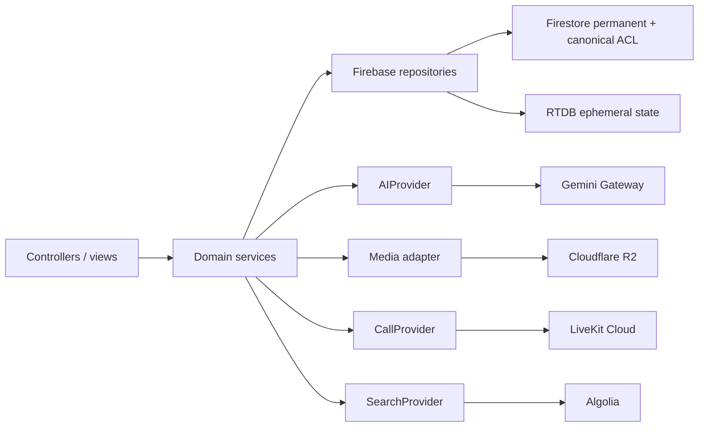

# Architecture

永久訊息、canonical authorization 與 call lifecycle 存在 Firestore；RTDB 只保存 global connection presence、room typing/activity 與 AI draft；R2 保存媒體 object；LiveKit 保存即時 participant/track state；Algolia 是可重建的文字索引。

`src/main.ts` 只啟動 `app/bootstrap.ts`。`SessionScope` 擁有登入期間的 global Presence、incoming call watcher、active LiveKit session、push foreground listener、timers 與 abort signals；`RoomScope` 在切房、撤銷或登出時只清除 room messages/members/reactions/read state、typing/activity 與 AI drafts。通話與 global Presence 不得由切房 lifecycle 結束。

RTC 的 server invariant 是 `rooms/{roomId}.activeCallId` 加上 transaction、operation ID 與 lease，不靠 disabled button。Incoming call 使用 `users/{uid}/incomingCalls/{callId}`；聊天 system message 只提供歷史 UI，不是 signaling source。詳見 [RTC](RTC.md)。

Functions 是同一 pnpm workspace 的 TypeScript package。所有 provider key 只透過 Secret Manager 供應，client 不持有 Gemini、R2、LiveKit 或 Algolia 管理金鑰。

Firestore 與 RTDB 沒有 distributed transaction。membership consistency 的完整狀態機見 [SECURITY](SECURITY.md)，決策背景見 [ADR-0001](adr/0001-room-membership-and-acl.md)。
